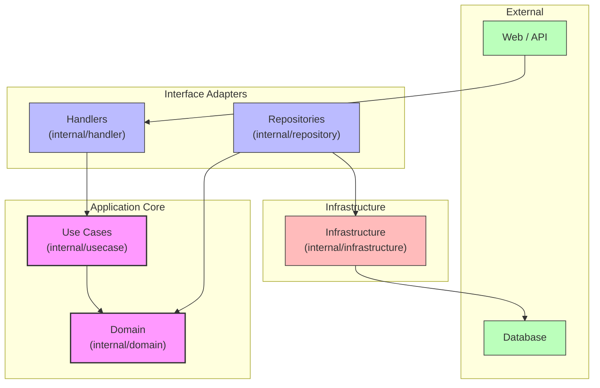
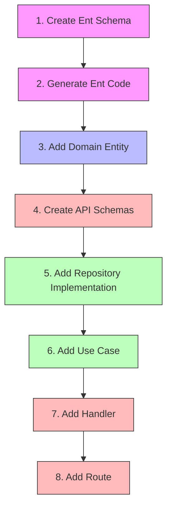
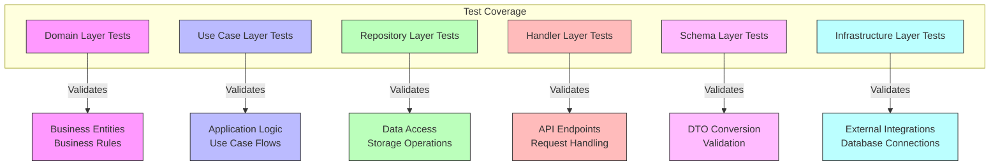
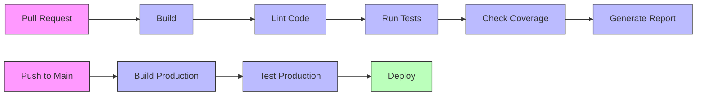
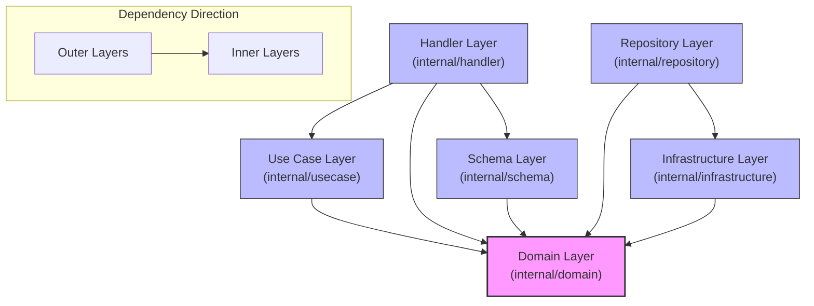

# Go Backend Boilerplate

A Go backend application boilerplate adopting Clean Architecture.

## Architecture

This project is designed according to the principles of [Clean Architecture](https://blog.cleancoder.com/uncle-bob/2012/08/13/the-clean-architecture.html).


### Project Architecture Diagram



### Layer Structure

- **Domain Layer** (`internal/domain/`): Contains business entities and repository interfaces. This layer represents the core business concepts and rules. It does not depend on any other layer.
- **Schema Layer** (`internal/schema/`): Contains request and response schemas for API communication. This layer is responsible for data transfer objects (DTOs) and conversion between domain entities and API schemas.
- **Use Case Layer** (`internal/usecase/`): Implements the business logic of the application. Depends only on the domain layer.
- **Interface Adapter Layer**:
  - **Handler** (`internal/handler/`): Processes HTTP requests, converts between schemas and domain entities, and calls use cases.
  - **Repository** (`internal/repository/`): Provides implementations of domain repository interfaces.
- **Infrastructure Layer** (`internal/infrastructure/`): Responsible for integration with external services such as database connections.

## Project Structure

```
.
├── .github/                # GitHub specific files
│   └── workflows/          # GitHub Actions workflows
│       └── ci.yaml         # Continuous Integration workflow
├── cmd/                    # Application entry points
│   ├── api/                # API server
│   └── entgen/             # Ent schema generation tool
├── ent/                    # Ent framework related code
│   └── schema/             # Database schema definitions
├── internal/               # Internal packages
│   ├── domain/             # Domain layer (business entities)
│   │   └── user/           # User domain entities
│   ├── handler/            # HTTP handlers
│   ├── infrastructure/     # Infrastructure layer
│   ├── schema/             # Request/Response schemas
│   │   └── database/       # Database connections
│   ├── repository/         # Repository implementations
│   └── usecase/            # Use cases (application logic)
├── .air.toml               # Air configuration file (hot reload)
├── .clinerules             # Cline editor dependency rules
├── .cursorrules            # Cursor editor dependency rules
├── .golangci.yml           # GolangCI-Lint configuration
├── compose.yml             # Docker Compose configuration
├── Dockerfile              # Docker image build configuration
├── go.mod                  # Go module definition
└── Makefile                # Build commands
```

## Technology Stack

- [Go](https://golang.org/) - Programming language
- [Ent](https://entgo.io/) - Entity framework (ORM)
- [Docker](https://www.docker.com/) - Containerization
- [Air](https://github.com/cosmtrek/air) - Hot reload development tool
- [GolangCI-Lint](https://golangci-lint.run/) - Go linters aggregator
- [GitHub Actions](https://github.com/features/actions) - CI/CD platform

## Setup

### Prerequisites

- Go 1.20 or higher
- Docker & Docker Compose
- Make

### Development Environment Setup

1. Clone the repository:
   ```bash
   git clone https://github.com/yourusername/easy-go-backend.git
   cd easy-go-backend
   ```

2. Install dependencies:
   ```bash
   go mod download
   ```

3. Start Docker containers:
   ```bash
   make up
   ```

4. Start development server:
   ```bash
   make dev
   ```

## Development Guidelines

### Development Workflow

```mermaid
graph TD
    Start[Start Development] --> Feature[Create Feature Branch]
    Feature --> Implement[Implement Feature]
    Implement --> Test[Write Tests]
    Test --> Lint[Run Linting]
    Lint --> Fix[Fix Issues]
    Fix --> PR[Create Pull Request]
    PR --> Review[Code Review]
    Review --> Merge[Merge to Main]
    
    classDef start fill:#bfb,stroke:#333,stroke-width:1px;
    classDef process fill:#bbf,stroke:#333,stroke-width:1px;
    classDef end fill:#fbb,stroke:#333,stroke-width:1px;
    
    class Start start;
    class Implement,Test,Lint,Fix,PR,Review process;
    class Merge end;
```

### Adding a New Entity



The steps in detail:

1. Create a new schema file in the `ent/schema/` directory
2. Run `cmd/entgen/entgen.go` to generate Ent code
3. Add a new domain entity and repository interface in `internal/domain/`
4. Create request/response schemas in `internal/schema/`
5. Add repository implementation in `internal/repository/`
6. Add use case in `internal/usecase/`
7. Add handler in `internal/handler/` (with conversion between schemas and domain entities)
8. Add route in `internal/handler/router.go`

### Testing

The project includes automated tests for all components except the `ent` directory, which is excluded from test runs. Each layer of the architecture has its own tests:



- **Domain Layer**: Tests for business entities and their behavior
- **Use Case Layer**: Tests for application logic and business rules
- **Repository Layer**: Tests for data access implementations
- **Handler Layer**: Tests for HTTP request handling
- **Schema Layer**: Tests for data transformation between API and domain models
- **Infrastructure Layer**: Tests for external service integrations

Run tests with:

```bash
make test       # Run tests (excluding ent directory)
make test.cover # Run tests with coverage (excluding ent directory)
make test.pkg   # Run tests for a specific package
```

### Linting

The project uses GolangCI-Lint for code quality checks and static analysis. This helps maintain code quality by detecting:

- Unused imports and variables
- Potential nil pointer dereferences
- Code style issues
- Possible bugs and anti-patterns
- And many other code quality issues

Run linting with:

```bash
make lint       # Run linters and automatically fix issues where possible
make api.lint.check  # Run linters without auto-fixing (useful for CI)
```

When adding new code, always ensure it passes both tests and linting checks before committing.

### CI/CD

The project includes GitHub Actions workflows for continuous integration. The CI pipeline runs tests and linting on each pull request and push to the main branch.



### Building

```bash
make build
```

## Dependency Rules

This project uses both `.cursorrules` and `.clinerules` files to strictly enforce Clean Architecture dependency rules. These files prevent inner layers from depending on outer layers.

### Dependency Flow Diagram



The dependency rules are:

- Domain layer should not depend on any other layer.
- Use case layer should only depend on domain layer.
- Repository layer should only depend on domain and infrastructure layers.
- Handler layer should only depend on domain and use case layers.
- Infrastructure layer should only depend on domain layer.

## License

MIT